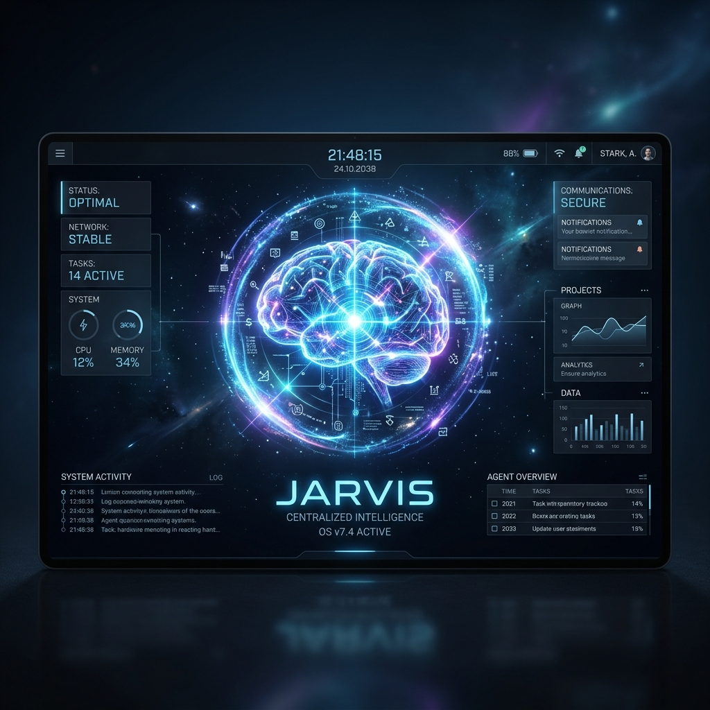

# Project JARVIS: The Self-Extending Agentic Operating System
---

## 🖼️ Project Thumbnail

---

## 📖 Project Description

### The Vision
The opportunity for personal AI agents to streamline our lives is incredible, but most current implementations are rigid, single-purpose chatbots reliant on cloud APIs that compromise privacy. **Project JARVIS** reimagines the personal AI assistant as a self-extending, autonomous Operating System running 100% locally. 

Instead of a single chatbot, JARVIS acts as a digital Chief of Staff. It is a centralized intelligence that can dynamically generate, deploy, and orchestrate specialized AI clones on the fly, while safely interacting with the user's local operating system.

### Core Architecture & Features

1. **The Clone Factory (Dynamic Agent Generation)** 
   When faced with a new, repetitive task (e.g., "track my daily expenses"), JARVIS doesn't just answer the question—it delegates. It routes the request to an internal "Creator Agent" that dynamically designs a highly specialized persona, writes a configuration payload, and permanently deploys a new specialized clone to the local filesystem. This clone instantly hot-reloads into the UI, expanding JARVIS's capabilities forever without writing a single line of code.

2. **Self-Correcting Autonomous Loop (System Protocol)** 
   JARVIS can explore your local computer to solve problems. We built a continuous, self-correcting feedback loop in the frontend. When JARVIS issues a safe terminal command (like `ls` or `cat`), the UI intercepts the command, automatically executes it in the background, and seamlessly feeds the terminal output back into JARVIS's memory. JARVIS then "thinks" about the output (visible to the user via a `<thought>` UI block) and autonomously iterates until the task is solved.

3. **Human-in-the-Loop Safety Filter**
   Because JARVIS runs locally, safety is paramount. The system evaluates every generated command against a strict heuristics engine. If JARVIS attempts a destructive or sensitive command (like `rm`, `sudo`, `curl`, or using `>` redirectors), the autonomous loop halts instantly. The UI renders the command in a secure block, explicitly requiring human approval before execution.

4. **Deep-Space Centralized UI**
   Built with React and Vite, the user interface ditches the cluttered "multi-agent sidebar" for a sleek, unified chat interface featuring a flowing, deep-space dark gradient. No matter which specialized clone JARVIS invokes in the background, the user interacts with one seamless, premium interface.

### Privacy & Security
JARVIS is completely local-first. Powered by a local FastAPI backend and lightweight local models (like `llama3.2:3b` via Ollama), no personal data, local file structures, or commands ever leave the user's machine. It fulfills the core promise of the Concierge track: deeply personal automation without sacrificing an ounce of privacy.

---
